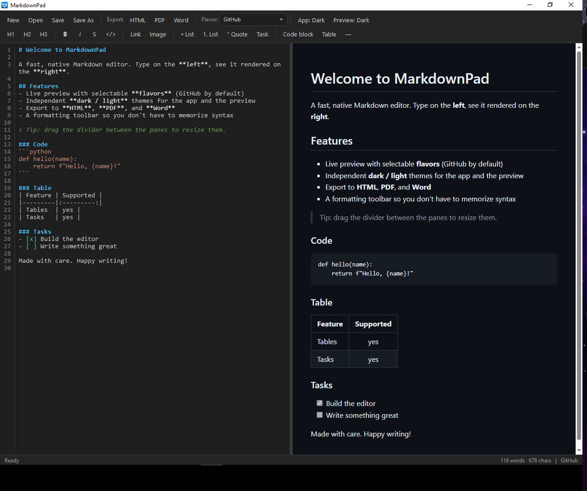

# MarkdownPad

A fast, lightweight, native Windows Markdown editor with a live side-by-side preview.



[](https://github.com/Noam-Elisha/MarkdownPad/releases/latest)
[](LICENSE)


## Features

- **Live preview** — type Markdown on the left, see it rendered on the right, instantly. Edits update in place without the preview jumping back to the top.
- **Resizable panes** — drag the divider to give the editor or the preview as much room as you want.
- **Selectable Markdown flavors** — GitHub (default), CommonMark, Markdown Extra, or Extended (everything on).
- **Export to HTML, PDF, and Word** — PDF uses the built-in renderer; `.docx` export uses [pandoc](https://pandoc.org/) if it's installed.
- **Independent dark / light themes** — toggle the app chrome and the preview separately.
- **Editor syntax highlighting** — headings, bold, italics, code, links, lists, quotes and more are colorized as you type.
- **Formatting toolbar** — one-click headings, bold/italic/strikethrough, links, images, lists, task items, tables, code blocks and horizontal rules, so you don't have to memorize Markdown syntax.
- **Native and quick** — a single self-contained Windows app; no Electron, no browser tab.

## Installation

1. Download **`MarkdownPad-Setup-x.y.z.exe`** from the [latest release](https://github.com/Noam-Elisha/MarkdownPad/releases/latest).
2. Run it. The installer is self-contained — you do **not** need to install .NET separately.
3. During setup you can opt to create a desktop shortcut and to associate `.md` / `.markdown` files with MarkdownPad.

> Requires Windows 10/11 (x64) and the [WebView2 runtime](https://developer.microsoft.com/microsoft-edge/webview2/), which is already present on virtually all up-to-date Windows machines.

### Making MarkdownPad your default Markdown editor

If you ticked the file-association option during install, MarkdownPad will be registered as a handler for `.md` and `.markdown` files. Because Windows protects the *default* app choice, you confirm it once:

- Right-click any `.md` file → **Open with** → **Choose another app** → pick **MarkdownPad** → check **Always use this app**, or
- **Settings → Apps → Default apps**, search for `.md`, and choose **MarkdownPad**.

## Exporting

| Format | How it works |
| ------ | ------------ |
| HTML   | Self-contained, styled HTML file. |
| PDF    | Rendered straight from the live preview. |
| Word   | Uses `pandoc` if found on your `PATH` (or a standard install location). Install it from [pandoc.org](https://pandoc.org/installing.html) to enable `.docx` export. |

## Keyboard shortcuts

| Shortcut | Action |
| -------- | ------ |
| `Ctrl+N` | New file |
| `Ctrl+O` | Open |
| `Ctrl+S` | Save |
| `Ctrl+Shift+S` | Save As |
| `Ctrl+B` | Bold |
| `Ctrl+I` | Italic |
| `Ctrl+K` | Insert link |

## Building from source

Requires the [.NET 8 SDK](https://dotnet.microsoft.com/download/dotnet/8.0).

```bash
# Clone
git clone https://github.com/Noam-Elisha/MarkdownPad.git
cd MarkdownPad

# Run
dotnet run

# Or produce a self-contained release build
dotnet publish -c Release -r win-x64 --self-contained true -o publish
```

### Building the installer

The installer is built with [Inno Setup 6](https://jrsoftware.org/isinfo.php):

```bash
dotnet publish -c Release -r win-x64 --self-contained true -o publish
ISCC.exe installer\MarkdownPad.iss
```

The resulting `MarkdownPad-Setup-x.y.z.exe` is written to the `installer` folder.

## Tech stack

- **C# / WPF on .NET 8** — native Windows UI.
- **[AvalonEdit](https://github.com/icsharpcode/AvalonEdit)** — the code editor with Markdown syntax highlighting.
- **[Markdig](https://github.com/xoofx/markdig)** — the Markdown-to-HTML engine powering the flavors.
- **[WebView2](https://developer.microsoft.com/microsoft-edge/webview2/)** — renders the live preview and exports PDF.
- **[pandoc](https://pandoc.org/)** (optional) — Word/`.docx` export.

## License

[MIT](LICENSE) © 2026 Noam Elisha
